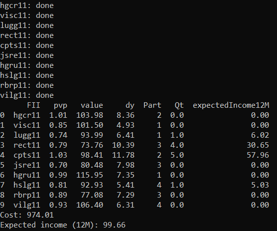

# fundsAllocation

# Objective

The ideia of this project is to maximize dividend (Real Estate specific), considering available resources, wallets and important indexes. Mathematically, the ideia is:

maximize: 

  

subject to:

  

  

  

Where:

* xij - Amount of shares from i-th wallet, j-th enterprise;
* dij - Dividend yield from i-th wallet, j-th enterprise's share;
* b - Financial boundary - The total amount of available resources to invest;
* pij - Relation between net worth and amount of total share amount;
* p - Maximum mean relation between net worth and amount of total share amount expected to achieve;

# How to use

In the same folder this project was cloned, two files must be created:

* ListFiis.txt - Must contain the chosen Real Estate shares of desire and from which wallet it comes from (without header). File example:

HGCR11,2 
VISC11,1 
LUGG11,1 
RECT11,3 
CPTS11,2 
JSRE11,3 
HGRU11,1 
HSLG11,4 
RBRP11,3 
VILG11,4 

* tolValues.txt - Must contain the Maximum mean relation between net worth and amount of total share amount expected to achieve and the expected value to invest (p and b). File example:

0.9,1000

When both files exist and are correctly filled, it is only needed to execute the main.py program. It is easier for Windows users, because it only requires to double click exec.bat file. The output will be as shown below:

  

